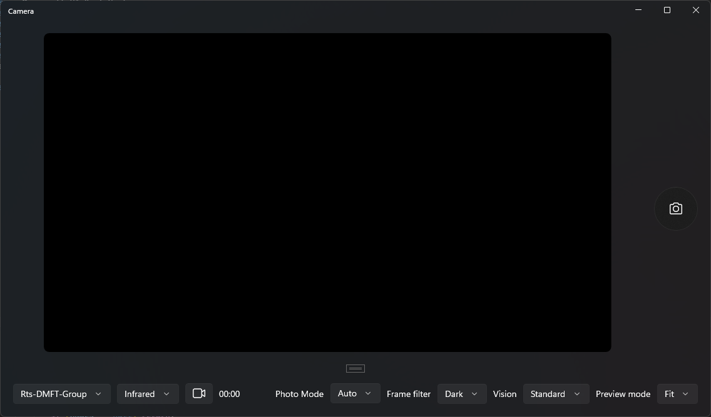
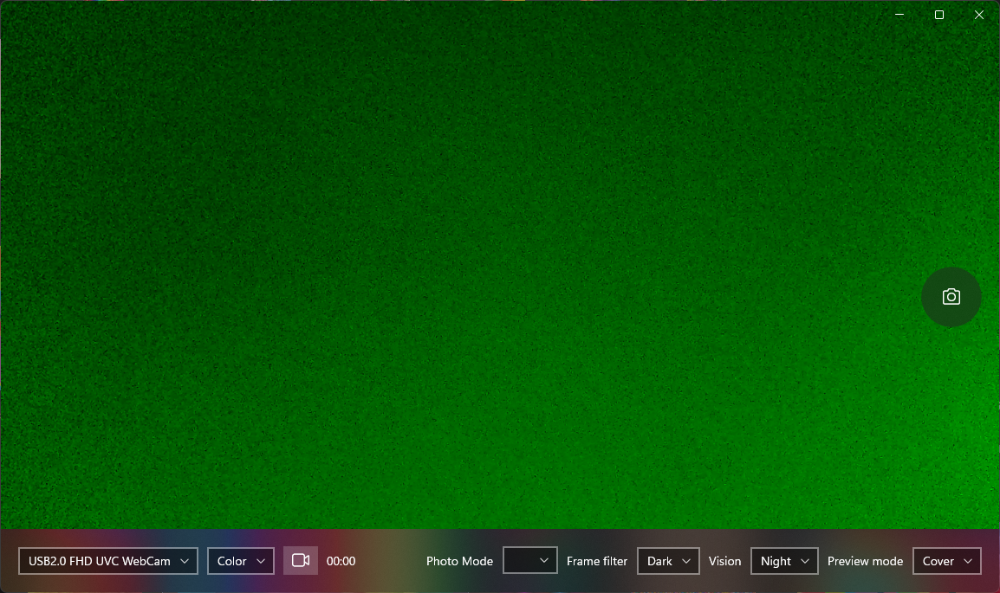

# IRCameraView

Get access to your infrared and depth cameras on Windows!

## Download

Download the [latest stable release](https://github.com/Iemand005/IRCameraView/releases/latest).

There are two versions, one built with WinUI and one built with UWP. The WinUI version has Windows 11 design and the UWP version Windows 10.

### Here's the WinUI version:

### And the UWP version:

Both compile from the same source code. The app can now be used as a normal camera app too. Photo capture fully works, images are save to your Pictures library folder. Video capture only works for colour camera's at the moment. Feel free to suggest changes or features. Do report bugs, you may create an issue on GitHub to reach out about it.

For reference, the only other example I found on how to do this is: https://github.com/andresbeltranc/ir_camera_sample_win32
